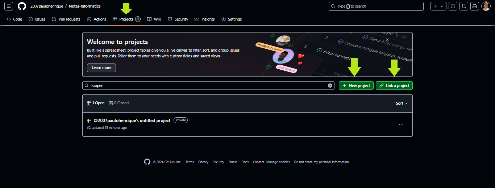
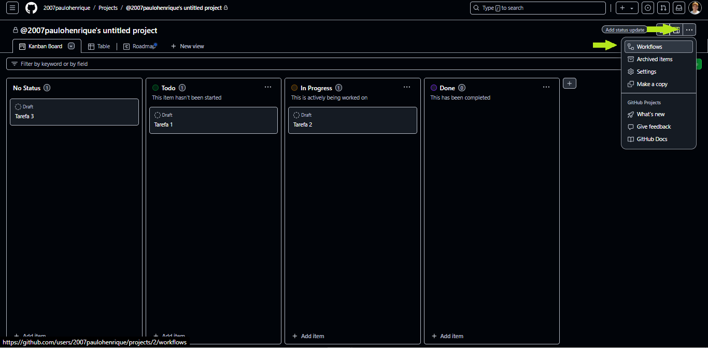
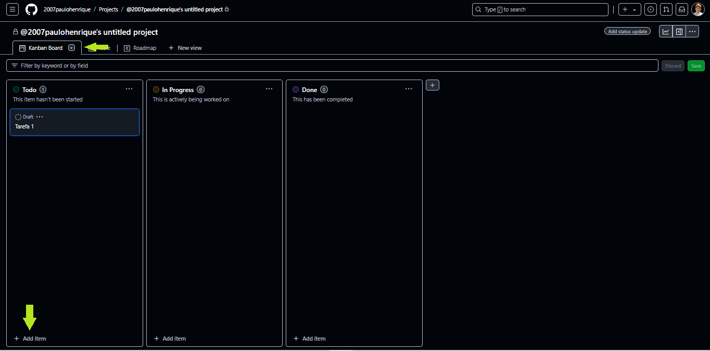
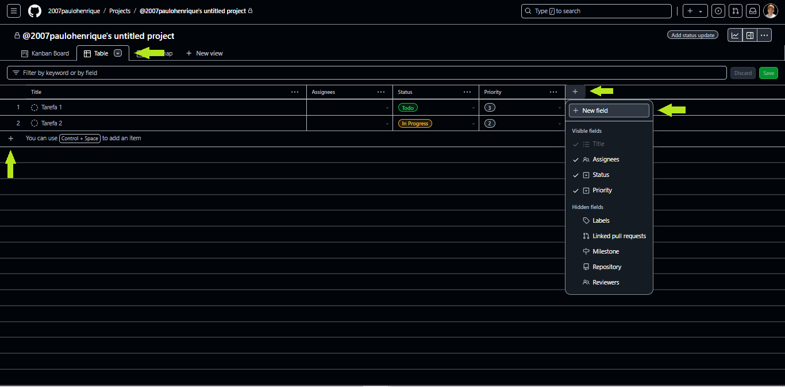
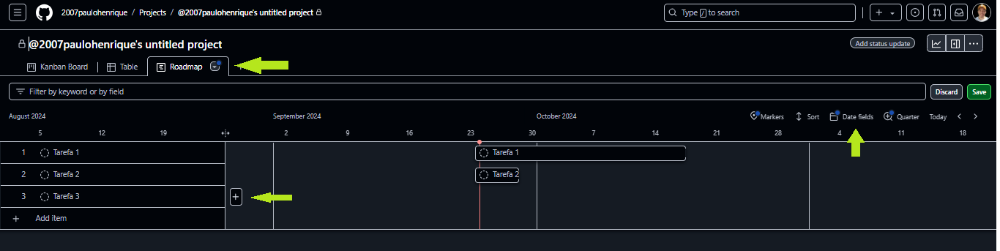
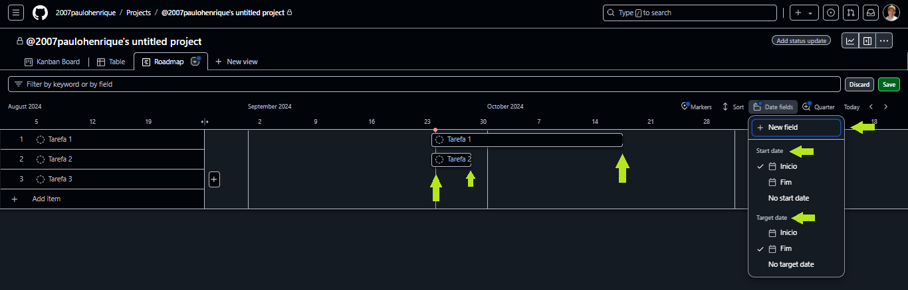

# GitHub Projects

Os GitHub Projects são uma ferramenta poderosa oferecida pelo GitHub para gerenciar tarefas e organizar projetos de forma visual e integrada ao repositório de código. Eles ajudam a acompanhar o progresso de um projeto usando tabelas, kanban boards, e timelines, tornando o gerenciamento de trabalho colaborativo mais eficiente.

Para ligar um repositório a um projeto, vá na aba "Projects" e clique em "Link a project", após isso selecione o projeto a ser linkado com o repositório. Com isso, o projeto e o repositório estarão diretamente integrados.

## Principais Características

1. **Views Personalizadas**:

GitHub Projects permite criar diferentes visualizações (views) do seu trabalho ou repositório, como tabelas personalizáveis, linhas do tempo para planejamento, e quadros Kanban.
As visualizações ajudam a entender o progresso, organizar as prioridades, e planejar etapas futuras. Todas as views, por mais que sejam diferentes, apresentam os mesmos dados do projeto, normalmente dados relacionados a Issues e Pull Requests de um repositório.  

- GitHub oferece modelos prontos para criar views rapidamente, como templates de Kanban básico, de acompanhamento de bugs, ou de sprints ágeis.
- GitHub Projects estão diretamente integrados com Issues e Pull Requests do repositório, o que permite vincular tarefas e acompanhar o progresso das contribuições de código.
- Você pode criar um issue diretamente a partir da view ou adicionar issues existentes.
- As automações podem ser aplicadas para automatizar processos com base em ações predefinidas, como mover um cartão para "Done" quando um Pull Request é mergeado.

2. **Boards (Quadros Kanban)**:

Uma das views que podem ser criadas, é um quadro Kanban com colunas para organizar tarefas em diferentes estágios, como "To Do" (A Fazer), "In Progress" (Em Progresso) e "Done" (Concluído).

- Cada cartão no quadro representa um Issue (Problema) ou Pull Request, que são as unidades de trabalho no GitHub.
- Permite arrastar e soltar cartões entre colunas, facilitando a visualização e o gerenciamento do progresso.
- É possível personalizar os quadros e adicionar colunas conforme necessário.

3. **Tables (Tabelas)**:

As Tabelas do GitHub Projects funcionam como planilhas dinâmicas que permitem organizar e visualizar tarefas de forma estruturada, com colunas personalizáveis para capturar informações detalhadas sobre cada item.

- Você pode adicionar colunas com diferentes tipos de dados, como texto, datas, números, seleções múltiplas, e referências a Issues e Pull Requests.
- As colunas podem ser personalizadas para capturar detalhes específicos, como prioridade, status, responsável, e prazo.
- É possível filtrar e ordenar as entradas para focar nas tarefas mais importantes, por exemplo, filtrando por data de vencimento ou prioridade.
- Cada linha da tabela pode ser vinculada a um Issue ou Pull Request, permitindo gerenciar o trabalho em um só lugar. Também é possível criar novos Issues diretamente da Tabela.

4. **Roadmaps**:

Os Roadmaps (Linhas do Tempo) são visualizações que ajudam a planejar e gerenciar projetos ao longo do tempo. Eles são ideais para acompanhar prazos, 
dependências e metas a longo prazo.

- Mostram o progresso de tarefas ao longo de um cronograma, permitindo ver claramente o que está planejado para o futuro e o que já foi concluído.
- Podem ser organizados por sprints, trimestres, ou qualquer período definido pela equipe.
- Tarefas podem ser facilmente ajustadas no cronograma, mudando prazos e reordenando prioridades diretamente no Roadmap.
- Visualize o status atual das tarefas e projetos, destacando o que está em risco de atraso.
- Roadmaps são úteis para planejar lançamentos de funcionalidades ou versões de produtos, ajudando a alinhar equipes e definir expectativas.

