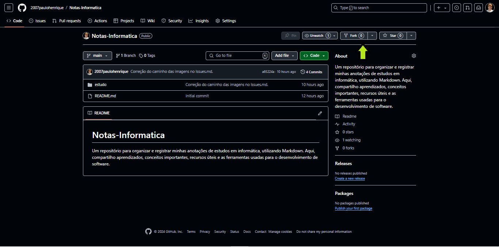
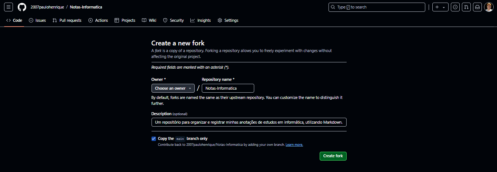

# Pull Request

Um Pull Request (PR) é uma solicitação para mesclar mudanças de um branch (ramo) em um repositório Git para outro branch, normalmente o branch principal (main ou master). Ele é usado para revisar e discutir as mudanças propostas antes de integrá-las ao código principal do projeto, além servirem como um registro detalhado de cada mudança no código, o que ajuda na documentação do projeto.

## Funcionamento 

1. **Criação do Branch**: Um desenvolvedor cria um branch separado para trabalhar em uma nova funcionalidade, correção de bug ou melhoria.
2. **Implementação de Mudanças**: As alterações são feitas e os commits são adicionados ao branch criado.
3. **Abertura do PR**: O desenvolvedor abre um Pull Request no GitHub para solicitar a revisão das mudanças. Nesse PR, ele pode adicionar um título, descrição comentar sobre as alterações feitas.
4. **Revisão de Código**: Outros membros do projeto (revisores) podem comentar, sugerir mudanças e aprovar ou solicitar ajustes.
5. **Integração (Merge)**: Após as revisões, quando todos estão de acordo, o PR é mesclado (merged) com o branch principal.

## Boas Práticas

1. **Escreva um Título e Descrição Clara**: Explicite o que a mudança faz e por que ela é necessária.
2. **Mantenha o PR Pequeno**: Alterações menores são mais fáceis de revisar.
3. **Responda aos Comentários**: Se revisores fazem comentários ou sugerem mudanças, responda e ajuste o código conforme necessário.
4. **Teste Suas Alterações**: Certifique-se de que o código funcione como esperado antes de abrir um PR.

## Como Criar

1. Faça um fork do repositório original (se for um projeto de terceiros).

2. Crie um branch novo para suas mudanças.
3. Faça as alterações necessárias e commit.
4. Push o branch para o seu fork.
5. Vá para o repositório no GitHub e abra um PR.
6. Adicione o título, descrição e selecione revisores, se necessário.
7. Clique em “Create Pull Request”.