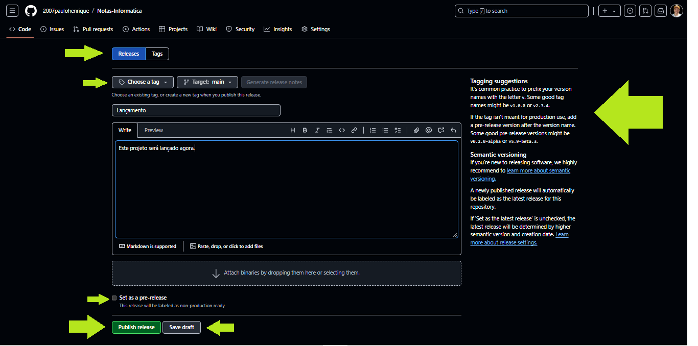

# Releases

Releases são um recurso do GitHub para gerenciar versões do seu software e compartilhar pacotes prontos para os usuários. Elas são baseadas nas tags do repositório e permitem aos desenvolvedores disponibilizar versões específicas do projeto junto com arquivos binários, notas de lançamento, e outras informações úteis.

- Pode-se criar um rascunho de release, que só será publicado quando estiver pronto. Isso é útil para preparar as notas de lançamento e verificar arquivos antes de disponibilizá-los publicamente.

## Formato

Release é uma versão marcada de um projeto que inclui:

- Uma tag (ponto de referência para uma versão específica no histórico do Git), normalmente indicando a versão do projeto.
- Arquivos binários ou de distribuição que podem ser baixados.
- Notas de lançamento (changelog), que documentam o que mudou, novos recursos, melhorias ou correções.

## Benefícios 

- **Distribuição fácil**: Usuários podem baixar versões estáveis sem clonar o repositório ou construir o projeto.
- **Notas organizadas**: As releases podem incluir changelogs detalhados, facilitando a comunicação das mudanças.