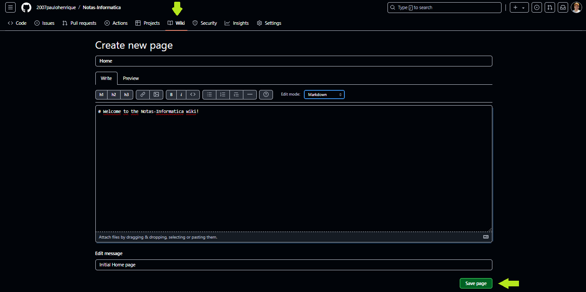
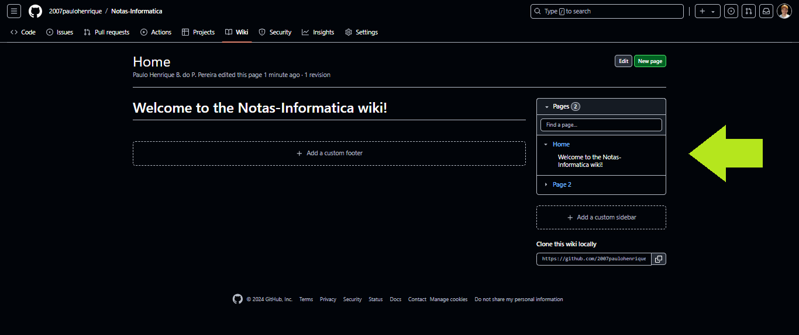
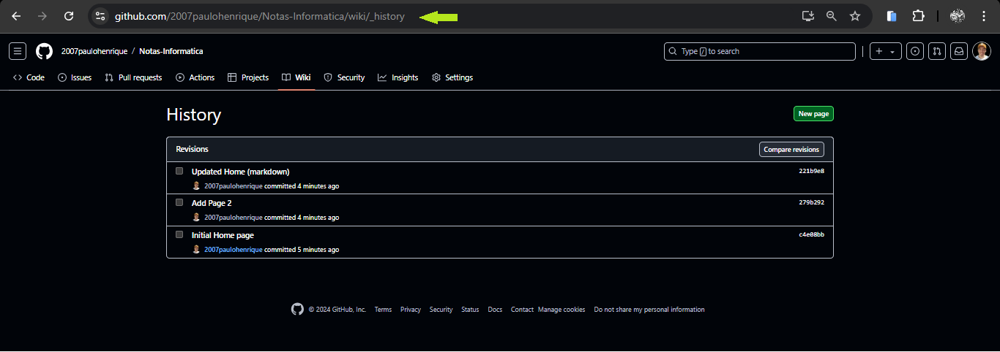

# GitHub Wiki

O GitHub Wiki é um recurso integrado aos repositórios do GitHub que oferece um ambiente de escrita colaborativa para documentar projetos. Cada repositório pode ter um Wiki próprio, onde você pode criar e editar páginas de documentação de forma organizada.

## Características

1. **Organização em Páginas**: Você pode criar múltiplas páginas e subpáginas, organizando a documentação de forma hierárquica.
2. **Editor Markdown**: As páginas do Wiki são escritas em Markdown.
4. **Controle de Versionamento**: O Wiki possui controle de versionamento próprio, o que permite ver o histórico de alterações de cada página, quem alterou e quando.
5. **Colaboração**: Qualquer colaborador do repositório pode contribuir para o Wiki, o que facilita a colaboração em equipe.
6. **Busca**: Há uma funcionalidade de busca que permite encontrar facilmente conteúdos dentro do Wiki.

## Como Usar

1. No repositório do GitHub, clique na aba "Wiki".
2. Para criar uma nova página, clique em "New Page".
3. Dê um nome à página e comece a editar usando Markdown.
4. Após escrever, clique em "Save Page" para salvar suas alterações.

5. As páginas são listadas na barra lateral, permitindo fácil navegação entre diferentes tópicos.

6. Use links internos para conectar diferentes páginas do Wiki, criando uma estrutura interligada.
7. Para ver o histórico de uma página, clique em "History" na página específica.
8. O histórico permite reverter para versões anteriores, se necessário.

9. O Wiki de um repositório pode ser clonado como um repositório Git separado, o que permite edições offline.

## Boas Práticas para GitHub Wiki

1. Garanta que a documentação acompanhe as mudanças do projeto.
2. Organize as páginas de forma lógica para que seja fácil navegar e encontrar informações.
3. Documentação deve ser fácil de entender, especialmente para novos contribuidores, por isso utilize linguagem clara e objetiva.
4. Use exemplos de código, diagramas e capturas de tela para ilustrar conceitos.
