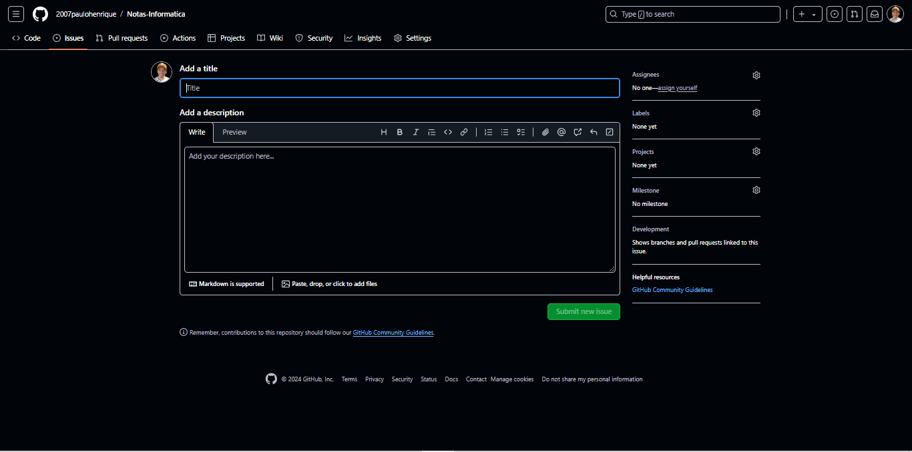

# Issues

As issues (ou "problemas") no GitHub são uma ferramenta essencial para gerenciamento de tarefas, bugs e discussões em projetos. Elas permitem que você e sua equipe organizem e acompanhem o trabalho de forma colaborativa. Uma issue pode ser definida como uma entrada em um repositório que representa um problema, uma tarefa, um recurso a ser desenvolvido, ou uma discussão. Elas podem ser usadas para relatar bugs, solicitar funcionalidades, ou documentar ideias.

## Funcionalidades 

1. **Criação de Issues**:

Para criar uma issue, clique na aba "Issues" do repositório e, em seguida, clicando no botão "New issue". As issues geralmente têm um título e uma descrição que explicam o que é necessário.

2. **Labels**:

As issues podem ser organizadas usando etiquetas (labels). Labels ajudam a categorizar as issues por tipo (bug, feature, improvement, etc.), prioridade, ou qualquer outro critério que você desejar.

3. **Atribuição**:

As issues podem ser atribuidas a membros da equipe, o que ajuda a esclarecer quem é responsável por resolver ou acompanhar a issue.

4. **Comentários**:

As issues permitem discussões através de comentários. Isso é útil para esclarecer requisitos, discutir soluções ou revisar o progresso.

5. **Fechamento**:

Quando uma issue é resolvida, ela pode ser fechada. Isso pode ser feito automaticamente através de um commit que menciona a issue: `git commit -m "Fixes #numero-da-issue: mensagem"` ou manualmente.

## Fluxo de Trabalho com Issues

1. **Criação**: Um desenvolvedor ou membro da equipe cria uma issue para relatar um bug ou sugerir uma nova funcionalidade.
2. **Discussão**: A equipe discute a issue nos comentários, oferecendo feedback e sugerindo soluções.
3. **Atribuição**: A issue é atribuída a um desenvolvedor responsável.
4. **Resolução**: O desenvolvedor trabalha na solução e faz um commit que resolve a issue.
5. **Fechamento**: Após a revisão e a confirmação de que a issue foi resolvida, ela é fechada.